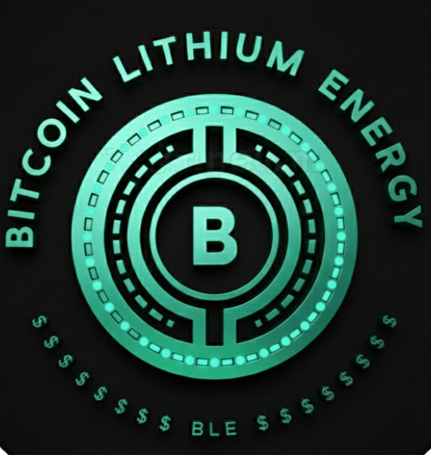

# Bitcoin Lithium Energy (BLE)

Bitcoin Lithium Energy (BLE) is a Solana-based crypto project focused on
green energy, low-cost electricity, EV charging infrastructure,
and crypto-based payments.

⚠️ Note: BLE here refers to Bitcoin Lithium Energy,
not Bluetooth Low Energy.

# BITCOIN LITHIUM ENERGY (BLE)

BITCOIN LITHIUM ENERGY (BLE) is a Solana-based crypto project focused on
green energy innovation, EV charging infrastructure, and blockchain-powered
energy solutions.

1️⃣ Project Name & Short Intro
Bitcoin Lithium Energy (BLE)
A blockchain-based project focused on green energy, EV infrastructure, and crypto payments.

2️⃣ Vision
•Build low-cost green energy solutions
•Support homes and EV charging
•Enable crypto payments for real-world  use
•Create a global crypto-based ecosystem

3️⃣ Key Use Cases
⚡ Low-cost energy supply (future)
🚗 BLE-owned EV charging points
💳 Crypto payment acceptance
🌱 Renewable & lithium-based energy concepts

4️⃣ Crypto Payment System
•Borderless digital payments
•Fast & transparent blockchain          transactions
•Global usability without banking       limits

5️⃣ Development Focus
•Own green energy development
•Step-by-step feature rollout
•Community-driven growth
•Long-term sustainability

6️⃣ Transparency
•Built on Solana
•Public on-chain data (Solscan)
•Fair launch mechanism
•Open community communication

7️⃣ Roadmap (Simple)
•Phase 1: Token launch & community      building
•Phase 2: EV & energy concept           development
•Phase 3: Crypto payment adoption &     expansion
 
 8️⃣ Disclaimer
Cryptocurrency projects involve risk.
This project is under active   development.
Please do your own research (DYOR).

## Token Details
- Name: BITCOIN LITHIUM ENERGY 
- Symbol: BLE
- Blockchain: Solana
- Mint Address:             AgA3ddHsUPk19xqCQiN9nzmTjS5JVWFyRDuA79Svpump

## Official Links
- Website: https://bitcoinlithiumenergy.carrd.co
- Twitter (X): https://x.com/@BITCOINLTENG
- Telegram: https://t.me/BLE108

## Transparency
- Liquidity: Planned / Locked
- Mint Authority: Disabled (if applicable)

This repository is created for official token verification and public transparency.

## ⚠️ Scam Warning

Bitcoin Lithium Energy (BLE) has only ONE official token on Solana.
Only trust the mint address and links listed in this GitHub repository.
Any other token or link using this name is not official.
